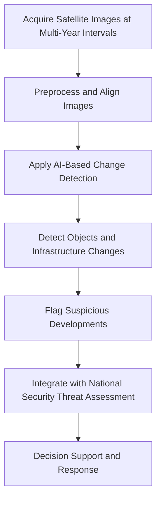

# Using AI for Analyzing Satellite Images in Defense: Methodologies, Datasets, and Applications for National Security Threat Detection

## Abstract

The integration of artificial intelligence (AI) with satellite imagery analysis has become pivotal in modern defense and national security operations. This report examines the use of AI to analyze satellite images captured over multi-year intervals—specifically focusing on 5-year gaps—to detect changes, identify suspicious developments, and flag potential threats. We review publicly accessible satellite imagery archives suitable for temporal analysis, survey state-of-the-art AI methodologies for change detection and object recognition, and explore datasets enabling multi-temporal research. Furthermore, we discuss frameworks for automated flagging of national security threats and the challenges inherent in operational deployment. While foundational AI techniques and datasets are publicly available, the report highlights the need for interdisciplinary integration with defense intelligence and addresses limitations related to data availability and adversarial risks. Recommendations for future research and practical workflows are provided.

---

## 1. Introduction

Satellite imagery has long been a cornerstone of defense and national security, providing critical geospatial intelligence for monitoring adversarial activities, infrastructure developments, and environmental changes. The advent of artificial intelligence (AI), particularly deep learning, has revolutionized the analysis of satellite images by enabling automated, scalable, and precise detection of objects and temporal changes. This capability is especially valuable when analyzing images captured over extended periods, such as with 5-year intervals, to identify developments that may pose threats to national security.

This report addresses the following research problem: **How can AI be effectively utilized to analyze satellite images taken over multi-year intervals to detect differences and flag developments that may threaten national security?** We synthesize recent research findings, publicly available satellite imagery sources, AI methodologies for change detection, and frameworks for threat flagging. The report aims to provide a comprehensive overview for defense analysts, AI researchers, and policymakers interested in leveraging AI for satellite image analysis in national security contexts.

The report is structured as follows: Section 2 reviews sources of satellite imagery suitable for multi-year temporal analysis. Section 3 surveys AI methodologies for change detection and object recognition in satellite images. Section 4 discusses datasets enabling multi-temporal satellite image research. Section 5 explores AI-based frameworks for flagging national security threats. Section 6 summarizes key insights and recommendations. Section 7 presents an illustrative workflow for AI-based satellite image analysis in defense. Finally, Section 8 lists references.

---

## 2. Sources of Satellite Imagery for Multi-Year Temporal Analysis

### 2.1 Publicly Accessible Satellite Image Archives

Access to satellite images spanning multiple years is essential for temporal change detection. Several public archives provide historical satellite imagery, though exact 5-year interval images may require custom extraction or interpolation due to satellite revisit schedules and archive completeness.

- **World Imagery Wayback**: This digital archive of the World Imagery basemap allows users to access different versions of imagery captured over the years, facilitating temporal comparisons of geographic areas [https://livingatlas.arcgis.com/wayback](https://livingatlas.arcgis.com/wayback).

- **NOAA Satellite Imagery Archive**: The National Oceanic and Atmospheric Administration (NOAA) offers comprehensive archives of environmental and geostationary satellite data, including Polar Operational Environmental Satellite (POES) and Geostationary Operational Environmental Satellite (GOES) datasets with multi-year coverage [https://www.ospo.noaa.gov/products/imagery/archive.html](https://www.ospo.noaa.gov/products/imagery/archive.html).

- **EOSDA LandViewer**: This platform provides free access to historical satellite images from multiple satellites such as Landsat 4–8, Sentinel 1 & 2, CBERS-4, and MODIS. It includes analytic tools supporting multi-year interval analysis [https://eos.com/blog/free-satellite-imagery-sources](https://eos.com/blog/free-satellite-imagery-sources).

- **USGS Earth Explorer**: The United States Geological Survey (USGS) Earth Explorer is a widely used authoritative source for free satellite imagery, including historical Landsat data, suitable for global multi-year temporal studies [https://earthexplorer.usgs.gov/](https://earthexplorer.usgs.gov/).

- **Programmatic Access Tutorials**: Python-based Jupyter notebooks and video tutorials demonstrate how to retrieve historical satellite images programmatically, enabling customized interval extraction [YouTube Tutorial](https://www.youtube.com/watch?v=G204nBZ6UEQ).

### 2.2 Limitations

- Exact 5-year interval images may not be directly available due to satellite revisit schedules and archive completeness.
- High-resolution or classified military satellite imagery with direct national security relevance is generally inaccessible publicly.
- Environmental-focused archives may have limited resolution or coverage for detailed defense analysis.

---

## 3. AI Methodologies for Change Detection in Satellite Imagery

AI techniques, especially deep learning, have become the dominant approach for analyzing satellite images to detect changes and identify objects relevant to defense.

### 3.1 Deep Learning for Object Detection and Semantic Segmentation

- **Convolutional Neural Networks (CNNs)** are widely used for detecting and classifying objects such as vehicles, ships, aircraft, and infrastructure in satellite images. These models enable effective change detection by identifying new or altered objects over time. Multi-stage detectors like Faster R-CNN and Cascade R-CNN balance accuracy and speed, critical for timely defense applications [1][2].

- **Semantic segmentation frameworks**, including attention-enhanced architectures such as tri-level attention DeepLabv3+, provide detailed feature extraction for land cover and infrastructure changes, supporting nuanced temporal analysis [3].

### 3.2 Structural Similarity and Principal Component Analysis

- Combining **Structural Similarity Index (SSIM)** with **Principal Component Analysis (PCA)** enhances sensitivity to subtle structural changes between temporal images, improving difference detection beyond pixel-wise comparisons [4].

### 3.3 Synthetic Aperture Radar (SAR) Imagery Analysis

- SAR imagery, analyzed with texture features and machine learning classifiers (SVM, random forests, neural networks), enables detection of man-made objects and activities under adverse weather or cloud cover, ensuring continuous surveillance capability [5].

### 3.4 Edge Computing and IoT Integration

- **Tactical Edge IoT** concepts facilitate real-time or near-real-time processing of satellite and geospatial data at the edge, enhancing situational awareness and rapid threat detection in defense environments [6].

---

## 4. Datasets for Multi-Temporal Satellite Image Change Detection

### 4.1 MuRA-T Dataset

- The MuRA-T dataset provides **aligned multi-temporal, multi-resolution satellite image stacks** combining monthly Planet images with lower resolution Landsat and Sentinel data. It is designed for change detection research and supports temporal analysis over periods suitable for multi-year analysis [7].

### 4.2 LAION-EO Dataset

- The LAION-EO dataset extracts satellite images from a large general image corpus using anchor datasets, offering extensive training and testing data for AI models in satellite image recognition [8].

### 4.3 Limitations

- No publicly available datasets explicitly provide satellite images at exact 5-year intervals; however, monthly or yearly temporal resolutions allow construction of such intervals.
- Datasets primarily support foundational research; operational defense applications may require proprietary or classified data.

---

## 5. AI-Based Flagging of National Security Threats

### 5.1 Automated Target Recognition (ATR)

- Deep learning models can automatically recognize mobile and fixed targets (vehicles, ships, aircraft, infrastructure) critical for defense surveillance, enabling monitoring of suspicious activities or unauthorized developments [2].

### 5.2 Integration with Defense Systems

- Real-time AI analysis combined with edge computing and IoT enhances rapid detection and flagging of anomalies or threats, supporting tactical decision-making [6].

### 5.3 Emerging Frameworks and Challenges

- While detailed AI models for automatic flagging of national security threats from satellite image changes are limited in public literature, proposed frameworks integrate AI detection outputs with threat intelligence and emergency preparedness systems [9][10].

- Counter-AI measures and adversarial threats to AI-powered satellite remote sensing highlight the need for robust defense frameworks [11].

### 5.4 Limitations

- Specific threat flagging algorithms are often proprietary or classified.
- Effective threat assessment requires integration of AI outputs with geopolitical intelligence and operational protocols.

---

## 6. Summary and Recommendations

| Aspect                          | Key Points                                                                                      |
|--------------------------------|------------------------------------------------------------------------------------------------|
| **Satellite Imagery Sources**  | Multiple public archives provide historical images; exact 5-year interval images require custom extraction. |
| **AI Change Detection Methods** | CNN-based object detection, semantic segmentation, SSIM-PCA, and SAR texture analysis are effective. |
| **Datasets**                   | MuRA-T and LAION-EO datasets support multi-temporal analysis; exact 5-year interval data not explicit. |
| **Threat Flagging**            | Automated target recognition and edge computing enable threat detection; detailed flagging models are limited publicly. |
| **Challenges**                | Data availability, classification of defense data, integration with intelligence frameworks, and counter-AI threats. |

---

## 7. Illustrative Workflow for AI-Based Satellite Image Analysis in Defense

---

## 8. Conclusion

AI-driven analysis of satellite imagery over multi-year intervals offers significant potential for enhancing defense capabilities by detecting changes and flagging developments that may pose national security threats. Publicly available datasets and AI methodologies provide a strong foundation; however, operational deployment requires access to high-resolution, multi-temporal satellite data and integration with domain-specific intelligence frameworks. Future research should focus on developing robust, explainable AI models for automated threat flagging and addressing challenges related to data availability, adversarial threats, and interdisciplinary integration.

---

## 9. References

1. Austen Groener et al., "A Comparison of Deep Learning Object Detection Models for Satellite Imagery," 2020. [https://arxiv.org/abs/2009.04857v1](https://arxiv.org/abs/2009.04857v1)  
2. Mark Pritt, "Deep Learning for Recognizing Mobile Targets in Satellite Imagery," 2020. [https://arxiv.org/abs/2010.06520v1](https://arxiv.org/abs/2010.06520v1)  
3. Jon Alvarez Justo et al., "Semantic Segmentation in Satellite Hyperspectral Imagery by Deep Learning," 2023. [https://arxiv.org/abs/2310.16210v4](https://arxiv.org/abs/2310.16210v4)  
4. Benyamin Ghojogh et al., "Principal Component Analysis Using Structural Similarity Index for Images," 2019. [https://arxiv.org/abs/1908.09287v1](https://arxiv.org/abs/1908.09287v1)  
5. Michael Harner et al., "Detecting the Presence of Vehicles and Equipment in SAR Imagery Using Image Texture Features," 2020. [https://arxiv.org/abs/2009.04866v1](https://arxiv.org/abs/2009.04866v1)  
6. Paula Fraga-Lamas and Tiago M. Fernandez-Carames, "Tactical Edge IoT in Defense and National Security," 2024. [https://arxiv.org/abs/2411.00511v1](https://arxiv.org/abs/2411.00511v1)  
7. Rahul Deshmukh et al., "An Aligned Multi-Temporal Multi-Resolution Satellite Image Dataset for Change Detection Research," 2023. [https://arxiv.org/abs/2302.12301v2](https://arxiv.org/abs/2302.12301v2)  
8. Mikolaj Czerkawski & Alistair Francis, "From LAION-5B to LAION-EO: Filtering Billions of Images Using Anchor Datasets for Satellite Image Extraction," 2023. [https://arxiv.org/abs/2309.15535v1](https://arxiv.org/abs/2309.15535v1)  
9. Alejandro Ortega, "AI threats to national security can be countered through an incident regime," 2025. [https://arxiv.org/abs/2503.19887v5](https://arxiv.org/abs/2503.19887v5)  
10. Akash Wasil et al., "AI Emergency Preparedness: Examining the federal government's ability to detect and respond to AI-related national security threats," 2024. [https://arxiv.org/abs/2407.17347v2](https://arxiv.org/abs/2407.17347v2)  
11. "The emerging AI battlespace: Counter-AI threats to AI-powered satellite remote sensing analysis," The Bulletin, 2026. [https://thebulletin.org/premium/2026-05/the-emerging-ai-battlespace-counter-ai-threats-to-ai-powered-satellite-remote-sensing-analysis](https://thebulletin.org/premium/2026-05/the-emerging-ai-battlespace-counter-ai-threats-to-ai-powered-satellite-remote-sensing-analysis)  

---

*This report synthesizes publicly available research and resources to provide a comprehensive overview of AI applications in satellite image analysis for defense. For operational deployment, collaboration with governmental agencies and access to classified datasets may be necessary.*